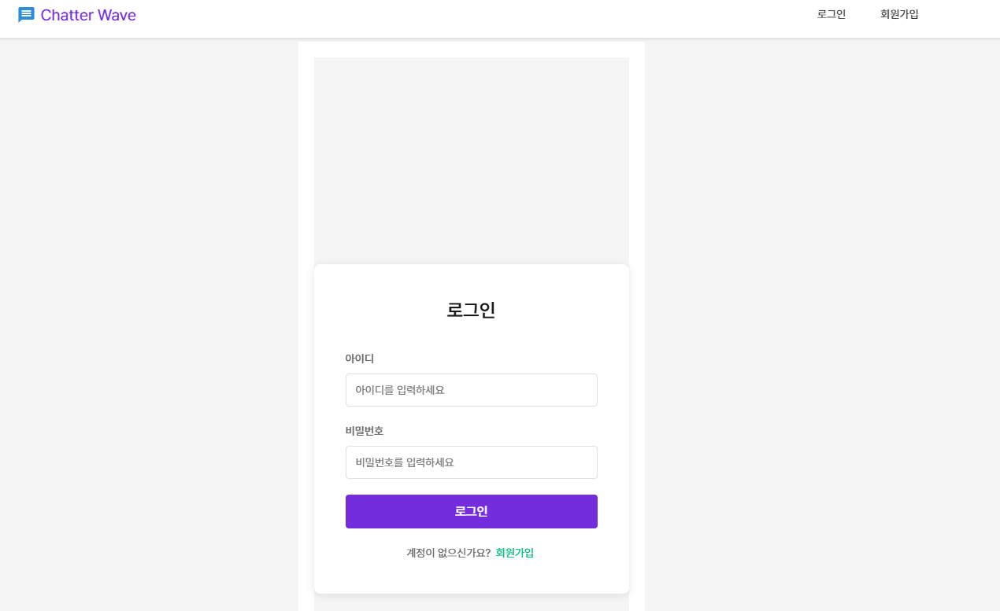

# `Chatter Wave`

## `BERT` 기반 미니프로젝트

1. `KcELECTRA` 모델이 탑재된 자동 혐오표현 감지가 가능한 채팅서버  

- `main` 페이지 

- `채팅` 페이지 

- `채팅 목록 조회` 

- `혐오표현 경고` 

- `차단 이벤트` 

- `로그인` 

- `회원가입`

- `차단된 회원 가리기` 

---- 
# 웹 구축 특이점 

# 1. 🔑 JWT를 이용한 회원 보안 강화 

- 사이트 이동중 -> 웹소켓 등 여러 기능들을 이용중에 회원 보안을 위한 토큰 감별 사용 

# 2. 차단된 회원 사후처리 
- `3회 경고` 이후 혐오 표현 사용자 차단하여 채팅 라우터를 일정시간 접근하지 못하도록 설정 

# 3. 메세지 캐싱 
- 모델을 통한 메세지 혐오 유무 확인으로 인해 API 요청을 2번 사용 → 이로 인한 채팅서비스 속도 저하 

- 메세지 캐싱을 통해 약 3초 정도 속도 완화 

---- 

## 추후 기능 추가사항 
1. `Docker` 를 통한 매개 독립 

2. `Grafana`를 통한 혐오 표현 관리 

-----

# 최종 아키텍처 메커니즘 

1. 백서버 
    - `FastAPI` 

2. 프론트서버 
    - `Vue.JS` 

3. 컨테이너 
    - `MSA`를 통한 독립된 환경을 통해 각각 실행 
    
    - `DB` , `MLFlow`, `Minio`, `Front`, `Back`, `Serving` 모두 

