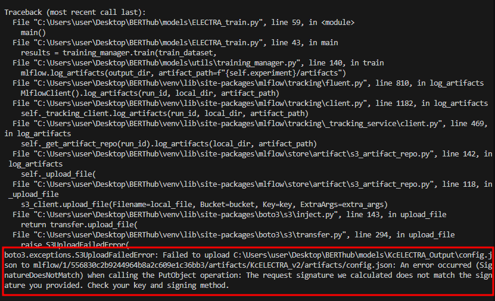
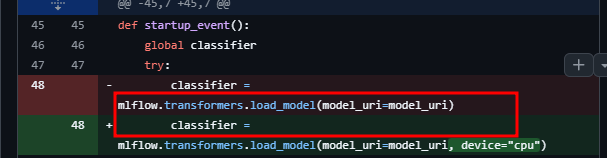
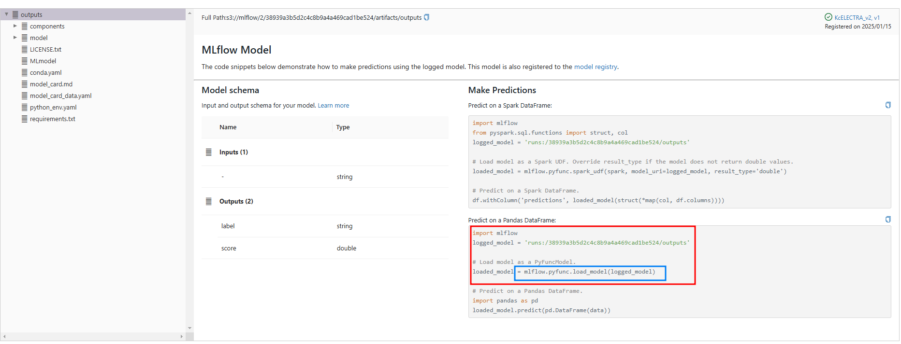
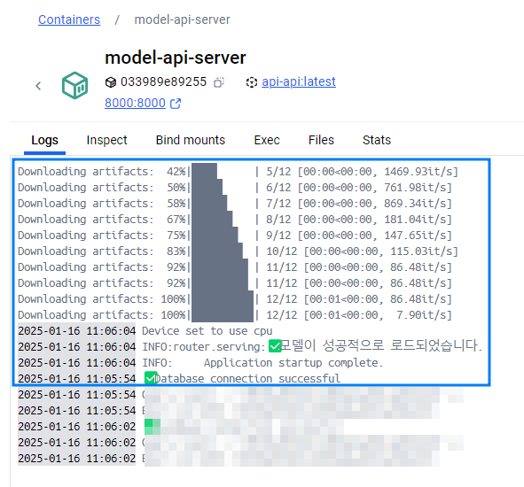

# 언어모델을 활용한 혐오표현 마스킹 서비스(가제)

1. 브랜치 전략 

```bash
  dev
    ├── feature/MLops
    ├── feature/api
    ├── feature/electra
    ├── feature/nginx
    ├── feature/Docker
* main
```

- 기능별로 브랜치 개설하며 생성 예정

- 현재 완료 내용 → `BERT`, `ELECTRA`, 학습 완료 / 실험실 구축 완료

2. `nginx` 구축 

- 리버스 프록시 기반 : 포트 숨기고, 안전한 로드밸런싱을 위해서 구축 


3. 각 기능별 `Dockerizing` 추가 후 `MSA` 구축 
- `Fastapi`, `nginx`, `Mlflow`, `minio`, `PostgreSQL` 등을 담은 3가지 컨테이너로 분류 

- 만약 이들 컨테이너 중 한개라도 터진다 해도 서비스 불가 방지 위해 각 컨테이너 별 별개 프로세스로 운영 


`Error` : 문제가 무엇인지? 



- boto3 기반으로 운영하는 minio api가 연결되지 않는 문제가 발생 

>`원인` : `Docker` ↔ `Docker` 간의 통신 방법과 `Docker` ↔ `local` 통신 방법의 차이로 인해 연결 불가 

> `해결방법` : 결국 `mlflow` 는 컨테이너 안에 존재, 가져오려는 객체는 `local` 서버에서 존재하기에 통신 방법을 다르게 하여 접근 `<container name>:port` 가 아닌 `localhost:port`로 접근하여 연결 

`트러블슈팅` 완료

----

`FastAPI`가 담긴 컨테이너 로드 중 문제 

```bash
2025-01-16 10:02:43 INFO:     Will watch for changes in these directories: ['/app']
2025-01-16 10:02:43 INFO:     Uvicorn running on http://0.0.0.0:8000 (Press CTRL+C to quit)
2025-01-16 10:02:43 INFO:     Started reloader process [1] using StatReload
2025-01-16 10:02:49 INFO:     Started server process [39]
2025-01-16 10:02:49 INFO:     Waiting for application startup.
2025-01-16 10:02:50 INFO:botocore.credentials:Found credentials in environment variables.
2025-01-16 10:02:51 
Downloading artifacts:   0%|          | 0/12 [00:00<?, ?it/s]
Downloading artifacts:   8%|▊         | 1/12 [00:00<00:00, 13934.56it/s]
Downloading artifacts:  17%|█▋        | 2/12 [00:00<00:00, 1524.37it/s] 
Downloading artifacts:  25%|██▌       | 3/12 [00:00<00:00, 1758.62it/s]
Downloading artifacts:  33%|███▎      | 4/12 [00:00<00:00, 1116.69it/s]
Downloading artifacts:  42%|████▏     | 5/12 [00:00<00:00, 1225.47it/s]
Downloading artifacts:  50%|█████     | 6/12 [00:00<00:00, 1345.84it/s]
Downloading artifacts:  58%|█████▊    | 7/12 [00:00<00:00, 500.95it/s] 
Downloading artifacts:  67%|██████▋   | 8/12 [00:00<00:00, 518.34it/s]
Downloading artifacts:  75%|███████▌  | 9/12 [00:00<00:00, 203.26it/s]
Downloading artifacts:  83%|████████▎ | 10/12 [00:00<00:00, 201.86it/s]
Downloading artifacts:  92%|█████████▏| 11/12 [00:00<00:00, 180.06it/s]
Downloading artifacts: 100%|██████████| 12/12 [00:01<00:00, 10.86it/s] 
Downloading artifacts: 100%|██████████| 12/12 [00:01<00:00, 10.86it/s]
Downloading artifacts: 100%|██████████| 12/12 [00:01<00:00, 10.86it/s]
2025-01-16 10:02:52 2025/01/16 01:02:52 INFO mlflow.transformers: 'runs:/38939a3b5d2c4c8b9a4a469cad1be524/outputs' resolved as 's3://mlflow/2/38939a3b5d2c4c8b9a4a469cad1be524/artifacts/outputs'
2025-01-16 10:02:52 
Downloading artifacts:   0%|          | 0/1 [00:00<?, ?it/s]
Downloading artifacts: 100%|██████████| 1/1 [00:00<00:00, 79.00it/s]
Downloading artifacts: 100%|██████████| 1/1 [00:00<00:00, 77.58it/s]
2025-01-16 10:02:52 2025/01/16 01:02:52 WARNING mlflow.transformers.model_io: Could not specify device parameter for this pipeline type.Falling back to loading the model with the default device.
2025-01-16 10:02:54 ERROR:    Traceback (most recent call last):
2025-01-16 10:02:54   File "/usr/local/lib/python3.9/site-packages/starlette/routing.py", line 677, in lifespan
2025-01-16 10:02:54     async with self.lifespan_context(app) as maybe_state:
2025-01-16 10:02:54   File "/usr/local/lib/python3.9/site-packages/starlette/routing.py", line 566, in __aenter__
2025-01-16 10:02:54     await self._router.startup()
2025-01-16 10:02:54   File "/usr/local/lib/python3.9/site-packages/starlette/routing.py", line 656, in startup
2025-01-16 10:02:54     handler()
2025-01-16 10:02:54   File "/app/router/serving.py", line 48, in startup_event
2025-01-16 10:02:54     classifier = mlflow.transformers.load_model(model_uri=model_uri, device="cpu")
2025-01-16 10:02:54   File "/usr/local/lib/python3.9/site-packages/mlflow/transformers/__init__.py", line 1128, in load_model
2025-01-16 10:02:54     return _load_model(local_model_path, flavor_config, return_type, device, **kwargs)
2025-01-16 10:02:54   File "/usr/local/lib/python3.9/site-packages/mlflow/transformers/__init__.py", line 1316, in _load_model
2025-01-16 10:02:54     model_and_components = load_model_and_components_from_local(
2025-01-16 10:02:54   File "/usr/local/lib/python3.9/site-packages/mlflow/transformers/model_io.py", line 106, in load_model_and_components_from_local
2025-01-16 10:02:54     loaded[component_key] = _load_component(
2025-01-16 10:02:54   File "/usr/local/lib/python3.9/site-packages/mlflow/transformers/model_io.py", line 176, in _load_component
2025-01-16 10:02:54     return cls.from_pretrained(str(local_path), trust_remote_code=trust_remote)
2025-01-16 10:02:54   File "/usr/local/lib/python3.9/site-packages/transformers/tokenization_utils_base.py", line 1825, in from_pretrained
2025-01-16 10:02:54     return cls._from_pretrained(
2025-01-16 10:02:54   File "/usr/local/lib/python3.9/site-packages/transformers/tokenization_utils_base.py", line 1988, in _from_pretrained
2025-01-16 10:02:54     tokenizer = cls(*init_inputs, **init_kwargs)
2025-01-16 10:02:54   File "/usr/local/lib/python3.9/site-packages/transformers/tokenization_utils_fast.py", line 111, in __init__
2025-01-16 10:02:54     fast_tokenizer = TokenizerFast.from_file(fast_tokenizer_file)
2025-01-16 10:02:54 Exception: data did not match any variant of untagged enum ModelWrapper at line 149192 column 3
2025-01-16 10:02:54 
2025-01-16 10:02:54 ERROR:    Application startup failed. Exiting.
```

`Error` : 무엇이 문제인지? 

`문제원인` : `transformer` 및 `mlflow`간의 버전 문제 및 `mlflow`의 `transformers.load_model` 함수의 안정성 문제로 인해 발생 



5시간의 삽질 끝에 문제 해결 

`해결방법` 



`mlflow`에 존재하던 양식을 참고하여 적용 



# 성공